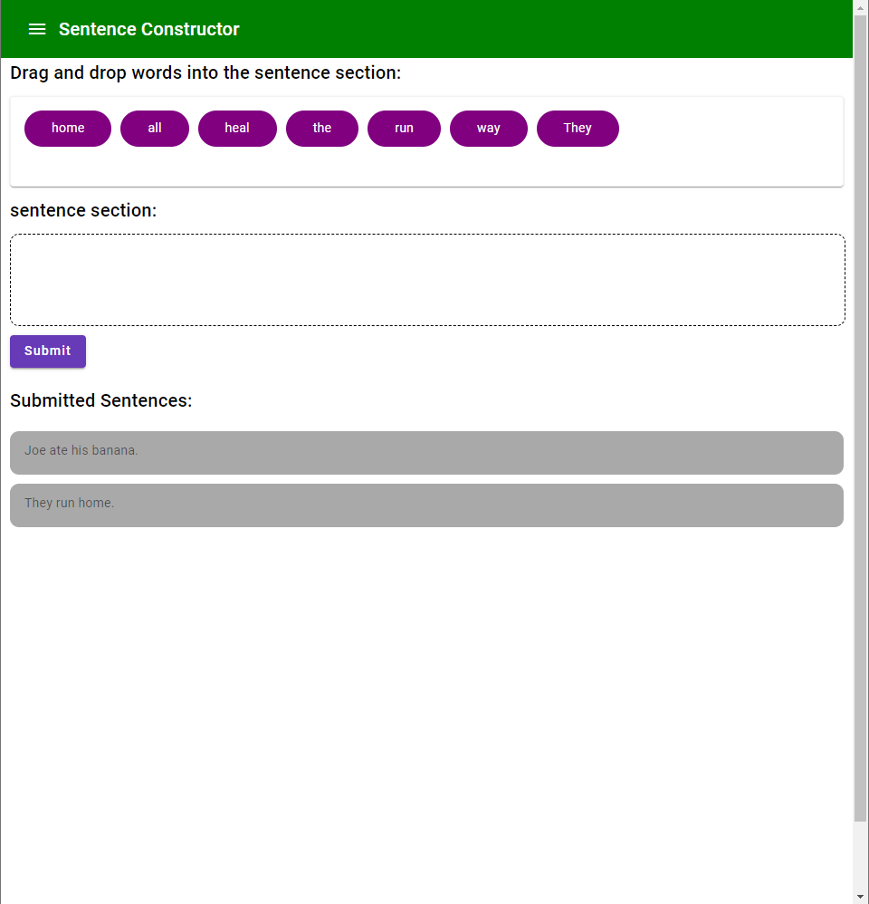
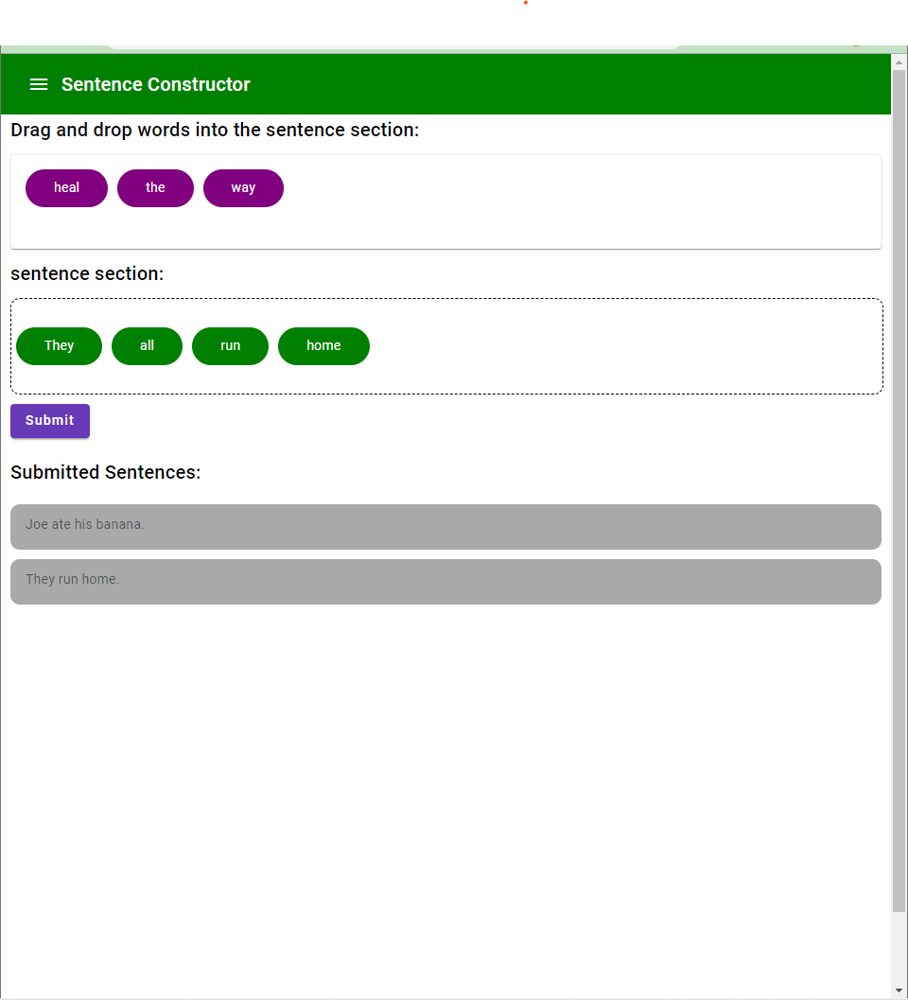

## RUNNING HILL SENTENCES CHALLENGE

## Screenshots

    

### Features: 
1. The user is able to drag and drop words to construct a sentence.
2. The user is able to submit the constructed sentence.
3. When the user hover over the word, they can see the type of each word.
4. The user is also able to see all the submitted sentences which are store on cloud.

### Future Features:
1. Migrate the whole database from noSql mongodb to Sql with Sql server and azure.
2. Once the user submit, validate the sentence and score the user's sentence.
3. Move to the next words once the user has submitted the sentence.
4. As the user progresses, generate more complicated words with difference parts of speech types.
5. Leaderboard where the user can see their progress.